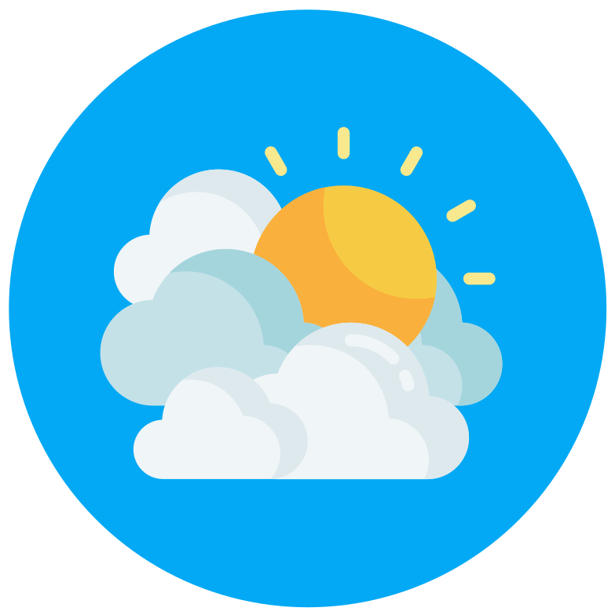

# PWSWatcher

## Why?

PWSWatcher is an open-source Android app used to monitor a *PWS* (Personal Weather Station) given the link of its real-time updated *.xml* file.  
There was already another application for the same purpose, but no updates have been released since 2013, so I decided to develop one for anyone who wanted to monitor weather stations.

## Table of contents

- [PWSWatcher](#pwswatcher)
  - [Why?](#why)
  - [Table of contents](#table-of-contents)
  - [Getting started](#getting-started)
    - [Download](#download)
    - [Usage](#usage)
  - [Other](#other)
    - [Contact](#contact)
    - [Credits](#credits)

## Getting started

Before starting check out [this page](https://bertolotti.dev/PWSWatcher/compatibilities) to see how to connect your PWS to PWS Watcher.

### Download

**OR** you can download the latest *.apk* file [here](https://github.com/GiorgioBertolotti/PWSWatcher/releases).  
**Note:** To install the *.apk* file on your Android device, you may have to [allow app installation from "Unknown Sources"](https://www.applivery.com/docs/troubleshooting/android-unknown-sources).

### Usage

Monitor source from app

| **Head into settings and add a new source**                                                       | **Check if the source has been added**                                                              | **Select the source from main page**                                                                 |
| ------------------------------------------------------------------------------------------------------ | -------------------------------------------------------------------------------------------------------- | --------------------------------------------------------------------------------------------------------- |
|  |  |  |

Add a new widget

| **Find the widget and place it**                                                                        | **Select a source to monitor**                                                                       | **Resize the widget**                                                                                     |
| ------------------------------------------------------------------------------------------------------------ | --------------------------------------------------------------------------------------------------------- | --------------------------------------------------------------------------------------------------------- |
|  |  |  |

## Other

### Contact

If there are any problems or you need any help feel free to contact me at [giorgio@bertolotti.dev](mailto:giorgio@bertolotti.dev).  
You can also reach me on [my website](https://bertolotti.dev/).

### Credits

All the icons I used in the app are downloaded from [FlatIcon](https://flaticon.com/).  
The authors of the icons are:

- [SmashIcons](https://www.flaticon.com/authors/smashicons)
- [Zlatko Najdenovski](https://www.flaticon.com/authors/zlatko-najdenovski)
- [monkik](https://www.flaticon.com/authors/monkik)
- [Freepik](https://www.freepik.com/)
- [Dario Ferrando](https://www.flaticon.com/authors/dario-ferrando)